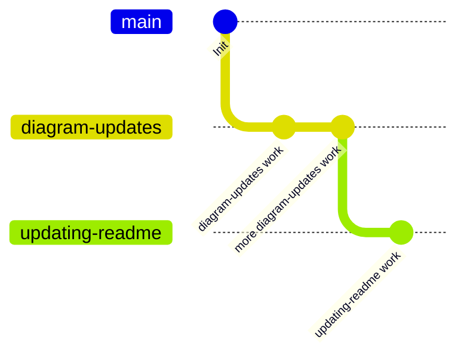

Can I add GIT diagram to this readme?

```mermaid


gitGraph
    commit id: "Init"
    branch diagram-updates
    commit id: "diagram-updates work"
    checkout diagram-updates
      commit id: "more diagram-updates work"
      checkout diagram-updates
      branch updating-readme
      commit id: "updating-readme work"
    
    
  


    
  


```