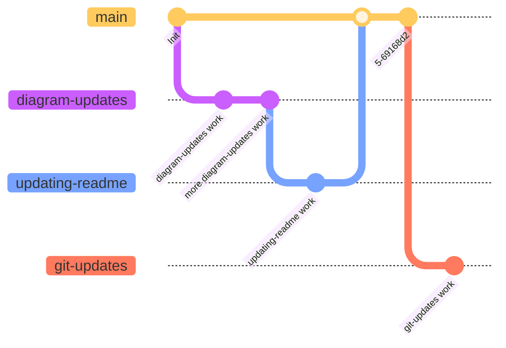

```mermaid
---
config:
  logLevel: 'debug'
  theme: 'base'
---
gitGraph
    checkout main
    commit id: "Init"
    branch diagram-updates
    commit id: "diagram-updates work"
    checkout diagram-updates
      commit id: "more diagram-updates work"
      checkout diagram-updates
      branch updating-readme
      commit id: "updating-readme work"
      checkout main
      merge updating-readme
      commit
      checkout main
      branch git-updates
      checkout git-updates
      commit id: "git-updates work"

```